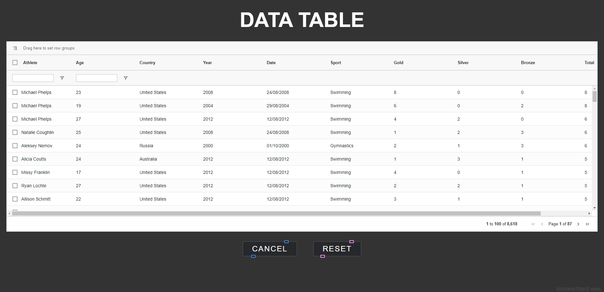

<h1 align="center">AG Grid Data Table</h1>

  
  
  

<h2>
<a href="https://try-ag-grid-data-table.vercel.app/">
 demo here
</a>
</h2>

## 📄 Description

This project uses Vite as the build tool, Vue3 as the front-end framework, and combines AG Grid Data Table to create a highly customizable data table application. AG Grid is a high-performance, feature-rich data table library that supports row and column pinning, sorting, filtering, pagination, and editing. Through this project, developers can quickly build their own data table applications and customize them according to their needs.

## 📋 Project Structure

1. Row and column pinning: Supports pinning rows and columns for easy viewing of key information while scrolling.
2. Sorting: Supports single-column and multi-column sorting, helping users quickly analyze data.
3. Filtering: Supports filtering for each column, allowing users to filter data according to their needs.
4. Pagination: Supports customizing the number of items displayed per page for paginated data display.
5. Editing: Supports cell content editing, enabling users to easily modify data.

## 🚀 Features

- The page is developed with Vue.js framework.
- Use AG Grid Data Table as the data table library, implementing a variety of table features.
- Build tool use Vite.
- There is no database required.

## 📦 Setup & Development Server

1. Run `npm i` or `npm install` to install the Node.js dependencies.
2. Run `npm run dev` to run server. Server is listening on localhost:5173.
3. Open `http://localhost:5173/` in your browser.

